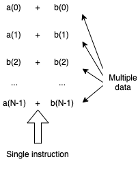
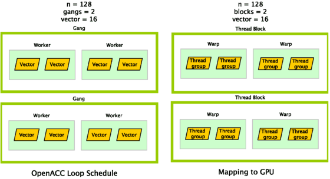

## Introduction to parallel programming techniques

## Part III:  OpenACC


Alan Chapman

HPC Systems Analyst

Arizona State University
    

***

# Outline of the presentation

- How GPU computing works
- GPU programming environment
- Host and Device parts of the code
- GPU architecture and OpenACC thread mapping
- GPU memory management
- Some OpenACC parallel constructs
- Compiles for OpenACC
- Compiler environment for performance info
- GPU computing cons and pros


## HOW GPU accelerated computing works

- Application starts and finishes running on a CPU
- Some code blocks can run on GPU
- Data is sent back and forth between the devices over PCIe bus
- Hardware architecture and code binaries are different
- CPU and GPU run cycles independently


## Type of compute tasks to run on GPU

Single Instruction Multiple Data (SIMD) simulations can efficiently run across many light weight threads on GPU Stream Multiprocessors.

For example, vector sum:




## GPU programming environments (CUDA)

Compiler extensions for C/C++ with CUDA and OpenCL. 
  
For example, two types of code blocks - host and device:

```c
  // Forward declaration of the matrix sum kernel
    __global__ void MatAddKernel(const Matrix, const Matrix, Matrix);
    {
       cudaMalloc(&device_A, size);
       cudaMemcpy(device_A, A, size, cudaMemcpyHostToDevice);
    }
```
Two sets of variables: host (`A`) and device (`device_A`).


## GPU programming environments (OpenACC)

High level Compiler directives with OpenACC. A kind of OpenMP.

```c
    #pragma acc parallel
        {
    #pragma acc loop
            for (i = 0; i < NX; i++) {
                vecC[i] = vecA[i] * vecB[i];
            }
        }
```

One set of variables for host and device: `vecC`, `vecB`, and `vecC`. 


## Host and Device parts of a code

A compiled executable contains two types of binaries: `host` and `device` parts.

- Data is initialized and may be computed on the CPU (host part)
- CPU calls to allocate memory space for DATA on GPU (host part)
- CPU sends data to the GPU (host part)
- CPU invokes GPU part of the code, kernel, to execute (device part)
- GPU executes its code (device part)
- CPU receives data from GPU (host part)


## GPU  threads, blocks, warps, and a grid

- Single computing operation on GPU is done by a `thread`.
- Threads are grouped into a `block`. 
- The number of threads in a block is defined by the code developer.
- Each block performs the same operation on all its threads.
- GPU employs a Single Instruction Multiple Thread (SIMT) architecture to manage and execute threads in groups of 32 called `warps`. 
- Data for each thread may be different.
- The blocks are scheduled and run independently of each other. 
- Blocks are organized into a one-dimensional, two-dimensional, or three-dimensional `grid` of thread blocks.


## OpenACC - GPU thread mapping



##  Memory Hierarchy

The threads may access data from multiple memory spaces during their execution.


## The main challenge in CUDA computing is memory management

- Data from the host arrives into the `global memory`, the slowest type of memory on th GPU.
- One should avoid using the `global memory` for thread computing. Copy data into the `shared memory`, compute,
 then copy results back into the `global memory`.
- Another challenge often happens due to noncalescent data alignment in `global memory`. Data is read in `warps` of size 32. For unstructured data, it may take multiple warp cycles to load the data into the `shared memory`.
- OpenACC can't really manage the memory, and completely relies on the compilers. Unlike CUDA, may not produce the most optimized code for the GPU architecture.


## OpenACC Kernels Construct


The kernels construct identifies a region of code that may contain parallelism, but relies on the automatic parallelization by compilers.

```c

#pragma acc kernels
{
 for (i=0; i<N; i++)
    { y[i] = 0.0f;
      x[i] = (float)(i+1); 
    }
 for (i=0; i<N; i++)
     y[i] = 2.0f * x[i] + y[i]; 
}
```

## The Parallel Construct


The parallel construct identifies a region of code that will be parallelized across OpenACC gangs.

```c

#pragma acc parallel loop 
{
  for (i=0; i<N; i++) 3
    y[i] = 0.0f;
    x[i] = (float)(i+1);
}

```

## Reduction clauses


Like in OpenMP, there are private and shared variables, and constructs protecting shared variables and optimizing performance.

```c


#pragma acc parallel loop reduction(max:error)
for( int j = 1; j < n-1; j++) 
{
    #pragma acc loop reduction(max:error)
    for(inti=1;i<m-1;i++) 
    {
        A[j][i] = 0.25*(Anew[j][i+1] + Anew[j][i-1] + Anew[j-1][i] + Anew[j+1][i]);
        error = fmax( error, fabs(A[j][i] - Anew[j][i])); 
    }
}
```


## Atomic clauses


Only one thread updates the variable at a time.


```c


#pragma acc parallel loop
   for(int i=0;i<N;i++) 
   {
     #pragma acc atomic update
        h[a[i]]+=1; 
   }
```

## Data clauses


Data clauses give the programmer additional control over how and when data is created on and copied to or from the device. Data stays close to the thread instead of travelling back and forth to the host.


```c

#pragma acc data create(x[0:N]) copyout(y[0:N])
{
#pragma acc parallel loop
  for (i=0; i<N; i++) 
  {
      y[i] = 0.0f;
      x[i] = (float)(i+1);
  }
#pragma acc parallel loop
  for (i=0; i<N; i++) 
      y[i] = 2.0f * x[i] + y[i];
}        
```

## Loop optimization by mapping to hardware

The fine grain parallelization by mapping the loops onto the GPU groups of threads may result in performance increase.


- Gang clause - partition the loop across gangs
- Worker clause - partition the loop across workers
- Vector clause - vectorize the loop
- Seq clause - do not partition this loop, run it sequentially instead


## Loop optimization example


```c


#pragma acc parallel loop gang
  for ( i=0; i<N; i++) 
     #pragma acc loop vector 
        for ( j=0; j<M; j++)
```

## Compilers and compilation

Compilers supporting OpenACC in Linux:

- Portland group (PGI)
```bash
pgcc -acc -⁠ta=tesla -o code.x code.c
```
- Nvidia HPC SDK
```bash
nvc -acc -o code.x code.c
```

- GNU compilers (gcc 10 or newer) with Nvidia or AMD offloader libs installed
```bash
gcc -fopenacc -foffload=nvptx-none -no-pie -o code.x code.c
```

## Scalar product example #1: sum = $(\vec{A} \cdot \vec{B})$ 

```c
#include <stdio.h>
#ifdef _OPENACC
#include <openacc.h>
#endif
#define NX 10240000
int main(void)
{
    double vecA[NX], vecB[NX], vecC[NX];
    double sum;
    int i;
    /* Initialization of the vectors */
    for (i = 0; i < NX; i++) 
    {
        vecA[i] = 1.0 / ((double) (NX - i));
        vecB[i] = vecA[i] * vecA[i];   
    }
    #pragma acc kernels loop
    for (i = 0; i < NX; i++) 
       vecC[i] = vecA[i] * vecB[i]; 
    sum = 0.0;
    /* Compute the check value */
    for (i = 0; i < NX; i++) 
        sum += vecC[i]; 
    printf("Reduction sum: %18.16f\n", sum);
    return 0;
}
```

## Performance inquiries

- Say, your OpenACC code, `sum_kernels.c`, was compiled and can run.

```bash
        nvc -acc -o sum_kernels sum_kernels.c

        ./sum_kernels
```
- Output:
```
    Reduction sum: 1.2020569031595896
```

- How do we know if the executable is indeed utilizing the GPU?

- How much processing time is spent on the GPU?

- How much time is spent on host-to-device data transfer?


## Nvidia HPC SDK Compiler directives for performance profiling

Environment variable NVCOMPILER_ACC_NOTIFY has the code to print a line of output each time it runs a kernel on the GPU:
```bash
export NVCOMPILER_ACC_NOTIFY=1
```

Environment variable NVCOMPILER_ACC_TIME, triggers the runtime summary of data movement between the host and GPU, and computation on the GPU:

```bash
export NVCOMPILER_ACC_TIME=1
```


## Output example

```yaml
launch CUDA kernel  file=/home/user/OpenACC/sum_kernels.c function=main line=21 device=0 threadid=1 num_gangs=65535 num_workers=1 vector_length=128 grid=65535 block=128
Reduction sum: 1.2020569031595896

Accelerator Kernel Timing data
/home/user/OpenACC/sum_kernels.c
  main  NVIDIA  devicenum=0
    time(us): 40,518
    21: compute region reached 1 time
        21: kernel launched 1 time
            grid: [65535]  block: [128]
             device time(us): total=3,477 max=3,477 min=3,477 avg=3,477
            elapsed time(us): total=3,537 max=3,537 min=3,537 avg=3,537
    21: data region reached 2 times
        21: data copyin transfers: 10
             device time(us): total=24,717 max=2,534 min=2,229 avg=2,471
        23: data copyout transfers: 5
             device time(us): total=12,324 max=2,523 min=2,232 avg=2,464
```

## Compiler feedback option, -⁠Minfo


```bash
    nvc -acc -o sum_kernels sum_kernels.c -Minfo
```

Compilation output:

```yaml
main:
     21, Loop is parallelizable
         Generating NVIDIA GPU code
         21, #pragma acc loop gang, vector(128) /* blockIdx.x threadIdx.x */
     21, Generating implicit copyin(vecA[:],vecB[:]) [if not already present]
         Generating implicit copyout(vecC[:]) [if not already present]
```


## Scalar product example #2: sum = $(\vec{A} \cdot \vec{B})$

```c
int main(void) 
{   
    double vecA[NX], vecB[NX], vecC[NX];
    double sum;
    int i;

    /* Initialization of the vectors */
    for (i = 0; i < NX; i++) 
    {
        vecA[i] = 1.0 / ((double) (NX - i));
        vecB[i] = vecA[i] * vecA[i];     
    }
    #pragma acc parallel
    {
    #pragma acc loop
        for (i = 0; i < NX; i++) 
            vecC[i] = vecA[i] * vecB[i]; 
    }
    sum = 0.0;
    /* Compute the check value */
    for (i = 0; i < NX; i++) 
        sum += vecC[i];
    
    printf("Reduction sum: %18.16f\n", sum);
    return 0;
}
```

## Output example

Notice quite better performance with lesser data transfer:
```yaml
launch CUDA kernel  file=/home/user/OpenACC/sum_parallel.c function=main line=21 device=0 threadid=1 num_gangs=800 num_workers=1 vector_length=128 grid=800 block=128
Reduction sum: 1.2020569031119110

Accelerator Kernel Timing data
/home/user/OpenACC/sum_parallel.c
  main  NVIDIA  devicenum=0
    time(us): 432
    21: compute region reached 1 time
        21: kernel launched 1 time
            grid: [800]  block: [128]
             device time(us): total=30 max=30 min=30 avg=30
            elapsed time(us): total=364 max=364 min=364 avg=364
    21: data region reached 2 times
        21: data copyin transfers: 2
             device time(us): total=268 max=141 min=127 avg=134
        26: data copyout transfers: 1
             device time(us): total=134 max=134 min=134 avg=134
```

## GPU computing cons and pros


Pros: 
- computing power for Single Instruction Multiple Data tasks thanks to available many GPU threads.
- Many applications are already developed and ported into CUDA and OpenACC.

Cons:
- Not beneficial for non SIMD computing.
- Nontrivial programming in CUDA.
- Relatively easy to program in OpenACC, but the performance may not be optimal.
- Hardware - compatibility and dependency on Nvidia support. Relatively old GPU hardware is no longer supported by latest Nvidia drives and library releases.
- OpenACC won't run on Nvidia hardware without Nvidia drivers and libraries.

## References

[CUDA C++ Programming Guide by Nvidia](https://docs.nvidia.com/cuda/cuda-c-programming-guide/index.html)

[OpenACC programming guide](https://www.openacc.org/sites/default/files/inline-files/OpenACC_Programming_Guide_0_0.pdf)

[OpenACC Getting Started Guide by Nvidia](https://docs.nvidia.com/hpc-sdk/compilers/openacc-gs/index.html#openacc-c-struct)

## Questions and discussion:
